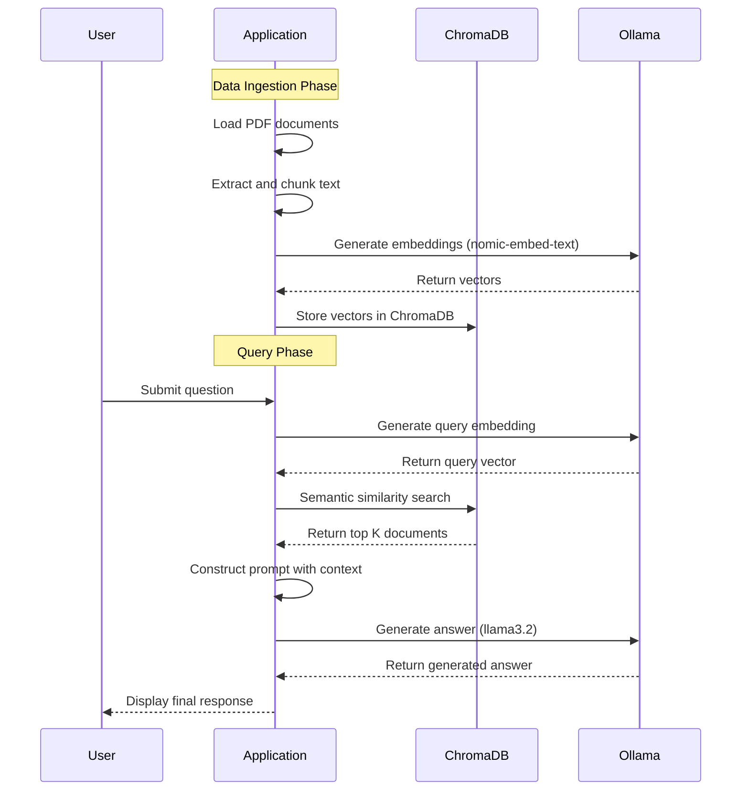

# RAG chatbot 
This is a Retrieval-Augmented Generation (RAG) chatbot that can answer questions based on content from PDF documents. The system uses local LLMs via Ollama and stores document embeddings in ChromaDB for efficient semantic search.

## Prerequisites

- Python 3.9+
- Ollama installed locally
- At least 8GB RAM recommended

### 1. Install Ollama and pull required models 

Follow the instructions for ollama installation from their official repository: https://github.com/ollama/ollama. We installed llama 3.2 model in this project. 

```bash
# Pull the embedding model
ollama pull nomic-embed-text

# Pull the language model (we use llama3.2 in this project)
ollama pull llama3.2


### 2. Install Python dependecies

```python
pip install -r requirements.txt
```

## Create database

Create the Chroma DB.

```python
python3 populate_database.py
```

## Query the database

Query the Chroma DB.

```python
python3 query_data.py "What is the goal of codenames?"
```


